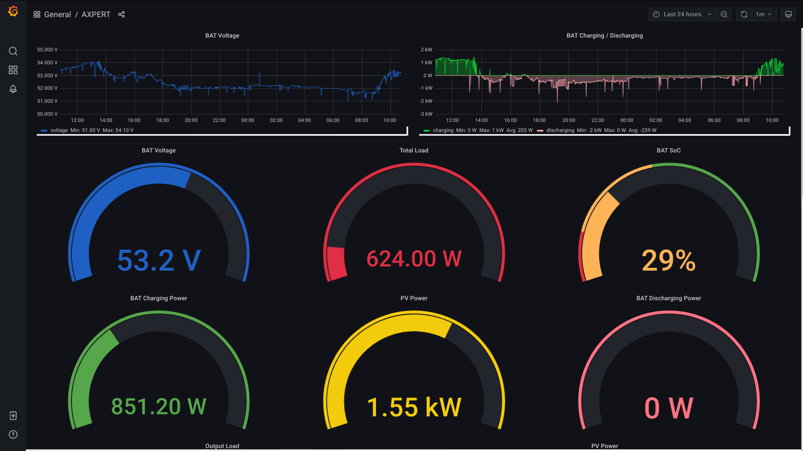
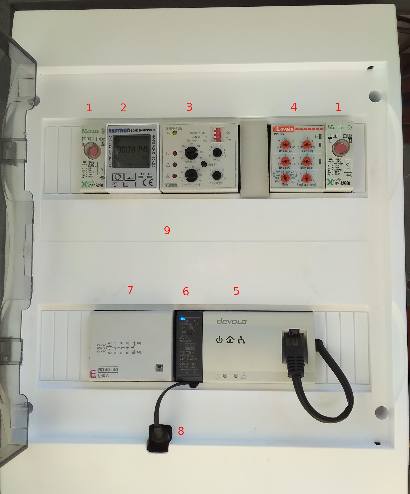
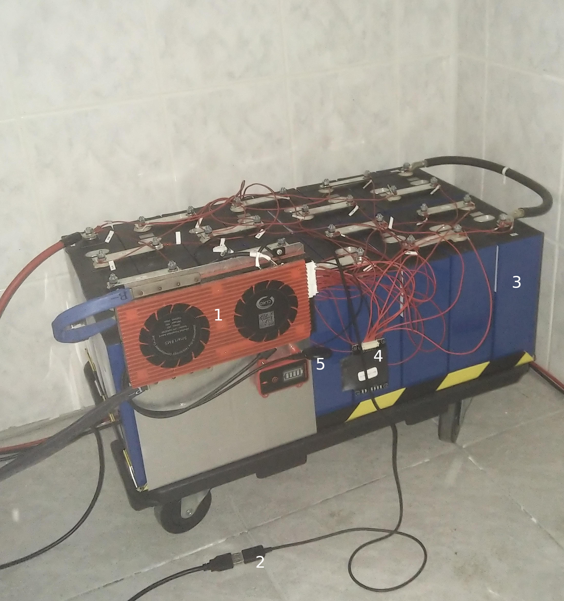
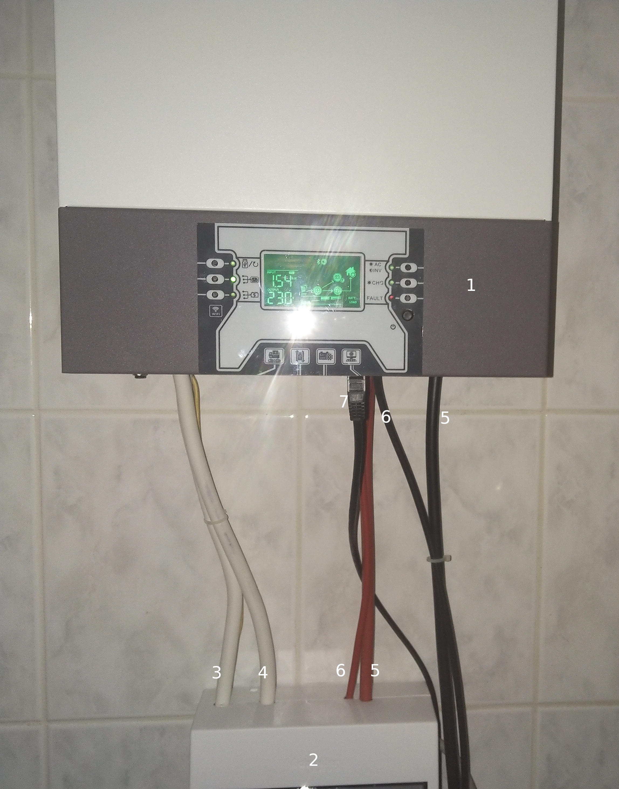
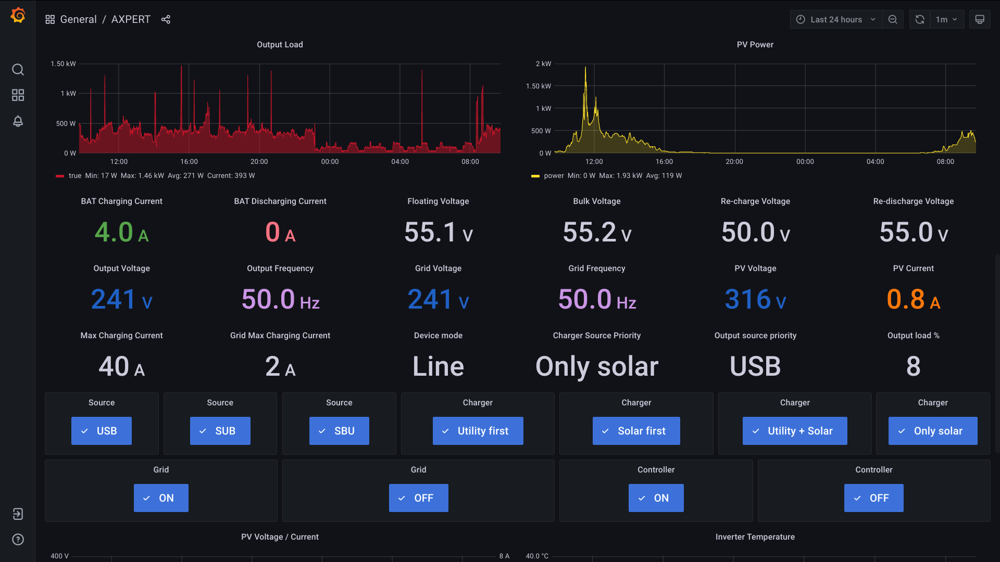
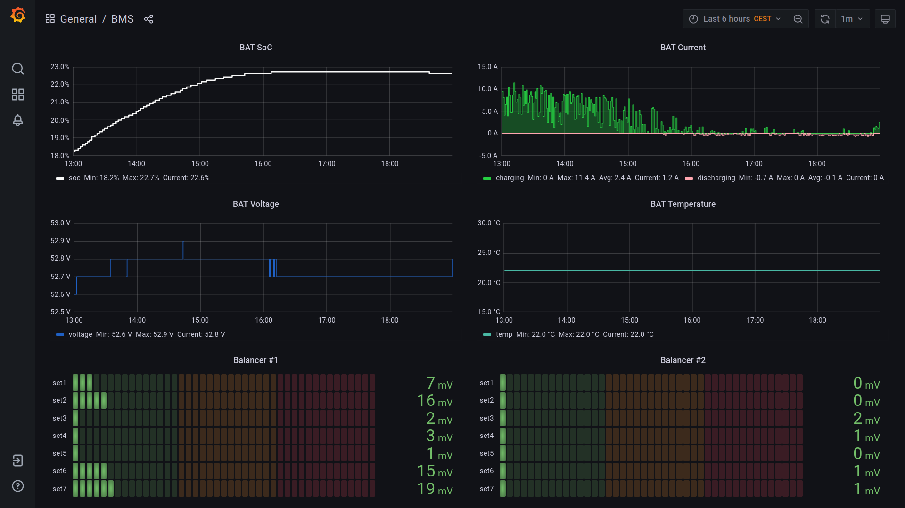
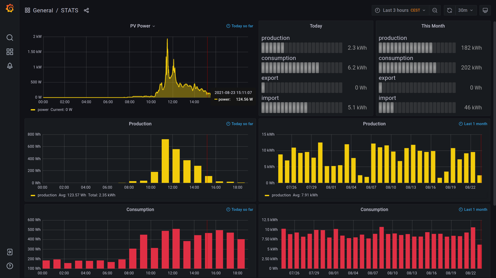

# Project
VoltronicAxpertSolarMonitorBMS

# Keywords
- voltronic
- axpert
- off-grid inverter
- solar monitor
- daly's battery monitoring system (BMS)
- prosumer
- directive (EU) 2018/2001

# Preamble
Directive (EU) 2018/2001 of the European Parliament establish basic framework for new prosumer phenomenon in the European Energy Union market. As soon as transposition of EU Directive come into force in state law, prosumers will be considered as active energy users who both consume and produce renewable energy. Future growth of prosumers over Europe will challenge current energy market participants and is aimed at keeping the EU a global leader in renewables and thus helping the EU to meet its emissions reduction commitments under the Paris Agreement.

# Overview
This project is build on ecosystem developed and fully supported by Raspberry PI team. The scope of this micro project is to implement:
- web based monitoring functions of photovoltaic solar system (PV) and off-grid inverter
- enhanced controller capabilities of off-grid inverter and BMS

# Main hardware components
1) RPI version 3 (controller of connectivity to the public grid) and RPI version 4 (data-logger and controller of off-grid inverter)
2) LiFePo4 16S battery bank (www.tipsun.net)
3) Daly's BMS 250A
4) 4th generation of Axpert/Voltronic off-grid inverter 5kW
5) distribution box connected directly to public grid

# HW implementation
Main focus of the project is to provide the software to general public under the MIT licence so description of hardware is simplified and before implementation should be consulted with qualified professional.

## Distribution box

1) lightning surge protectors
2) bi-directional power meter with RS485
3) over-voltage, under-voltage and grid assymetry protection relay
4) under and over frequency protection relay
5) powerline adapter 
6) AC/DC converter (230V/5V)
7) main switching relay (all poles connected in series)
8) raspberry PI 3 with USB/RS485 converter
9) 3V Module Board Shield with Optocoupler Relay connected to PORT 26 of RPI 3 (not visible) 

The switching relay (7) connects distribution grid to AC input of off-grid inverter in case RPI4 is not pingable or all following conditions are met:
- public grid parameters are in nominal values (controlled by 3 & 4)
- battery bank is discharging and voltage of LiFePO4 battery bank is lower than 51.2V for at least 4 minutes (controlled by 8 & 9)

## BMS

1) Daly's LiFePo4 battery management system. Overvoltage protection of individual cell is set to 3.57V and undervoltage to 2.58V via BMS bluetooth gadget.
2) USB/RS232 converter (Daly) connected to RPI 4
3) LiFePo4 16S
4) DYKB 1.2A active balancer and energy transfer board
5) BMS bluetooth gadget (disconnected)

## AXPERT 

1) 4th generation of Axpert/Voltronic off-grid inverter 5kW
2) circuit breaker box (AC+DC)
3) AC OUT (local grid)
4) AC IN (public grid)
5) DC IN (LiFePo4 16S)
6) DC IN (PV pannels)
7) USB/RS232 converter (Axagon) connected to RPI 4

# SW Implementation

## A. Raspberry PI core installation

Step 1. Download Raspbian Image
Grab a copy of the Raspbian image marked as "Lite”. Headless version can be found on https://www.raspberrypi.org/software/operating-systems/#raspberry-pi-os-32-bit

Step 2. Write Image to SD Card (SanDisk Extreme Pro)
Click on the link https://www.raspberrypi.org/documentation/computers/getting-started.html for more details.

Step 3. Add SSH file to the SD Card Root
Enable ssh service by placing empty file with name ssh into boot partition. 

Step 4. Connect to raspberry PI and secure it. SSH command can be used to connect to Raspberry PI also from a Windows 10 computer that is using October 2018 Update or later without having to use third-party clients e.g.: 
- ASBRU connection manager (https://www.asbru-cm.net)
- PUTTY (https://www.putty.org)
- VanDyke SecureCRT (https://www.vandyke.com/products/securecrt)

In order to secure device follow the instructions on https://www.vultr.com/docs/nftables-quickstart-guide and https://www.digitalocean.com/community/tutorials/how-to-set-up-ssh-keys-2. The ports used by running services are as follows:
- 22 (SSH)
- 3000 (Grafana)
- 3306 (SQL)
- 8080 (MBMD)
- 48211 (controllers)

Step 5. (optional) Enable wifi client by creating a text file called wpa_supplicant.conf. Place it into boot partition.

    country=US
    ctrl_interface=DIR=/var/run/wpa_supplicant GROUP=netdev
    update_config=1
    
    network={
    scan_ssid=1
    ssid="your_wifi_ssid"
    psk="your_wifi_password"
    }

## B. MariaDB installation (Raspberry Pi 4 with 4 GB of RAM is recommended)

For guidelines how to install SQL server click on the page https://raspberrytips.com/install-mariadb-raspberry-pi/

Step 1. Login to SQL server a apply project's specific commands

    sudo mysql -u root -p
    CREATE DATABASE axpert;
    CREATE USER 'admin'@'localhost' IDENTIFIED BY '<admin password>';  
    CREATE USER 'admin'@'<subnet e.g. 192.168.%>' IDENTIFIED BY '<admin password>';
    GRANT ALL PRIVILEGES ON axpert.* TO 'admin'@'localhost';
    GRANT ALL PRIVILEGES ON axpert.* TO 'admin'@'<subnet e.g. 192.168.%>';
    <copy and paste all commands from all *.sql files located in the folder SQL>;
    FLUSH PRIVILEGES;
    EXIT;

Step 2. Configure MySQL server to allow connections from remote clients. Change "bind-address = 127.0.0.1" found in /etc/mysql/mariadb.conf.d/50-server.cnf to "bind-address = 0.0.0.0" and restart the service or reboot device. 

Step 3. Install SQL Client on desktop PC in order to be able to remotely connect to AXPERT database. Guidelines how to install client can be found on https://www.mysql.com/products/workbench or https://dbeaver.io/download

## C. Grafana installation (Raspberry Pi 4 with 4 GB of RAM is recommended)

Purpose of this project is not to explain how Grafana works since it's easy to find more help on web. For installation guidelines click on the link https://grafana.com/tutorials/install-grafana-on-raspberry-pi/. After successful installation enter http://<rpi4_ip_address>:3000 in the browser and finish installation. Configure MySQL (core plugin) as default data source. Use following parameters:

    Name: MySQL 
    Host: localhost:3306
    Database: axpert
    User: admin
    Password: <admin password>
    Session Timezone: default

Before importing dashboards located in grafana folder install also plugin "Button Panel" located at web page https://github.com/cloudspout/cloudspout-button-panel that enables controlling of off-grid inverter and switch relay directly from the web interface.

## D. MBMD installation (Raspberry Pi 3 with 1 GB of RAM is recommended)

This application is used to read data from bidirectional energy meter Eastron SDM 230 via Modbus interface.

Step 1. Download compiled armv6 version located at https://github.com/volkszaehler/mbmd/releases

Step 2. Unpack and copy binary files to folder /usr/local/bin, if needed apply chmod +x command 

Step 3. Create mbmd.service in the folder /etc/systemd/system as follows:

    [Unit]
    Description=mbmd
    After=syslog.target
    [Service]
    ExecStartPre=/bin/sleep 20
    ExecStart=/usr/local/bin/mbmd run -a /dev/ttyUSB0 -d sdm230:1 -r 5s --api 0.0.0.0:8080
    Restart=always
    User=root
    [Install]
    WantedBy=multi-user.target

Step 4. Activate and start MBMD service

    systemctl enable mbmd
    systemctl start mbmd

## E. Installation of project's specific scripts

Step 1. Install additional plugins 

    sudo apt-get install python-statistics python-usb python-serial python-rpi.gpio python-requests python-mysqldb python-crcmod python-urllib3 python-smbus python-pathlib python-dev python-rpi.gpio-dbgsym python3-dev python3-smbus python3-rpi.gpio python3-rpi.gpio-dbgsym

Step 2. Bind USB devices under static name /dev/axpert and /dev/bms. For instructions how to bind click on https://unix.stackexchange.com/questions/66901/how-to-bind-usb-device-under-a-static-name

Step 3. clone git repository or copy (use scp command) all *.py and *.sh scripts into folder /home/pi, if needed apply chmod +x command 

Step 4. Create and activate rc-local service. Follow the guideline found on https://www.troublenow.org/752/debian-10-add-rc-local/

Step 5. Update /etc/rc.local

    cat rc.local  > /etc/rc.local

Step 6. Update /etc/crontab

    cat crontab > /etc/crontab

Step 7. Update IPs in files *.py, *.sh and AXPERT.json

    sed -i 's/rpi3/<rpi3_ip_address>/g' AXPERT.json
    sed -i 's/rpi4/<rpi4_ip_address>/g' AXPERT.json
    sed -i 's/rpi3/<rpi3_ip_address>/g' *.sh
    sed -i 's/rpi4/<rpi4_ip_address>/g' *.sh
    sed -i 's/rpi3/<rpi3_ip_address>/g' *.py
    sed -i 's/rpi4/<rpi4_ip_address>/g' *.py

Step 8. Update maximum battery charging current (optional)

    sed -i 's/MCHGC040/MCHGCXXX/g' controller.py

Step 9. Update SQL admin password in all *.py scripts

    sed -i 's/changeme!/<admin_password>/g' *.py

Step 10. Import all dashboards into grafana

Step 11. controller of off-grid inverter is disabled by default. To enable controller, connect to the SQL database and verify records and then click on button ON (controller) of dashboard AXPERT

# Dashboards

AXPERT dashboard

BMS dashboard

STATS dashboard

